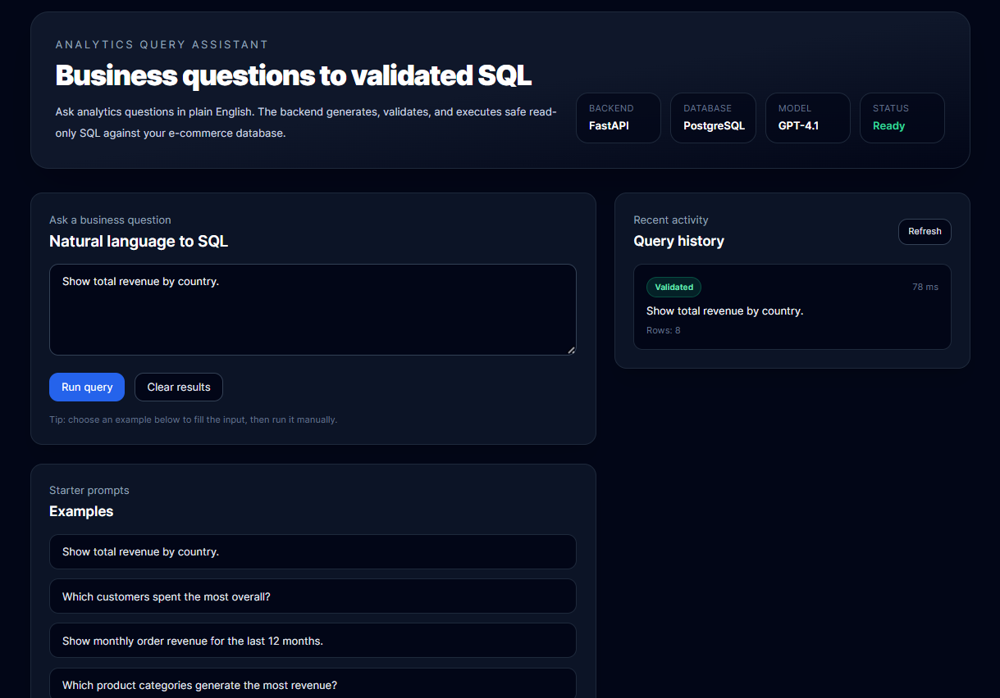
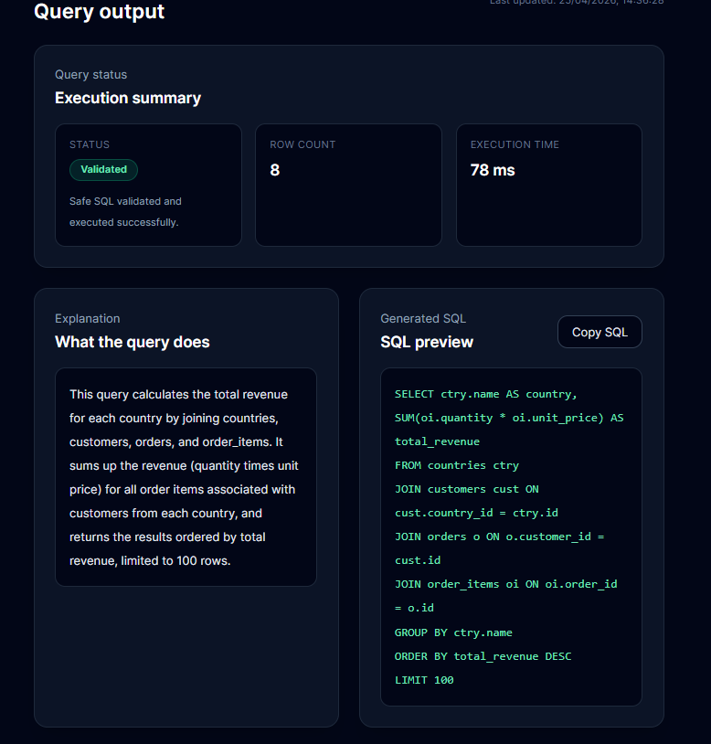
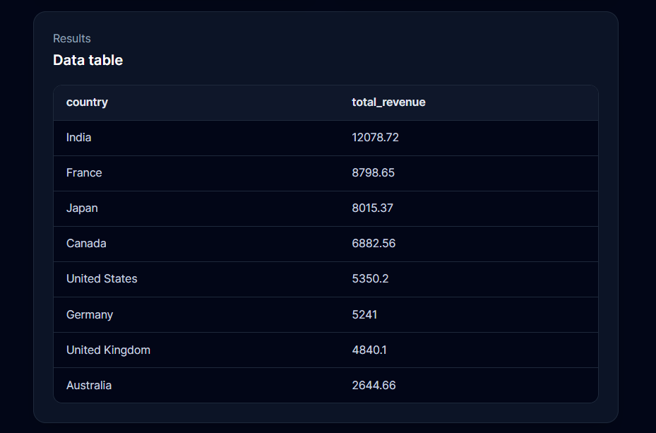
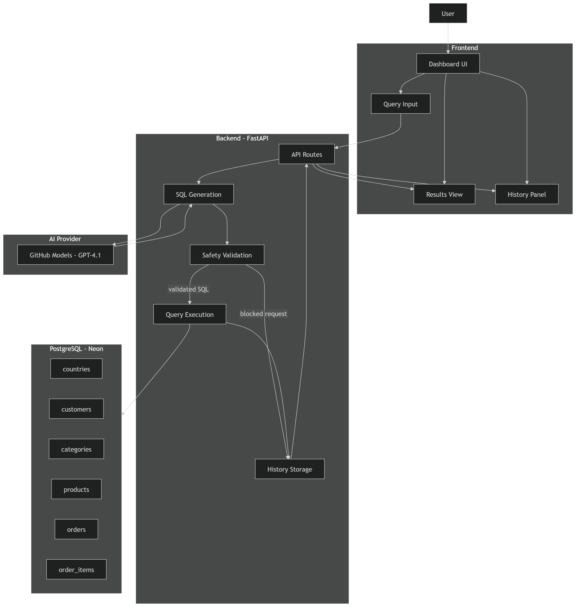
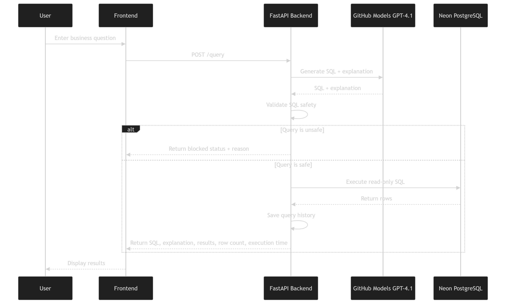

# Analytics Query Assistant

A full-stack analytics assistant that turns plain-English business questions into validated read-only SQL, executes the query safely against a PostgreSQL database, and presents the results in a clean, modern dashboard.

---

## Live Demo

**Try the app here:**  
https://analytics-query-assistant.vercel.app

> Note: The backend is hosted on Render’s free tier and may take a short time to wake up on the first request after inactivity.

## Screenshots

### Dashboard overview
<p>
  
</p>

### Query output
<p>
  
</p>

### Results table
<p>
  
</p>

## Overview

Analytics Query Assistant is a portfolio-grade full-stack project built around a practical product idea: let a user ask business questions in natural language and translate those questions into safe SQL for analytics.

Instead of forcing a user to write SQL manually, the system accepts a plain-English query such as:

- Show total revenue by country
- Show the top 10 customers by total spend
- Which product categories generate the most revenue?

The backend then:

1. sends the question to a language model
2. generates SQL from the user’s request
3. validates the SQL against strict safety rules
4. blocks unsafe or destructive statements
5. executes only safe read-only queries
6. returns structured results with metadata such as row count and execution time

The frontend presents this workflow in a polished dashboard with:

- natural language input
- example prompts
- query status
- explanation of what the SQL does
- generated SQL preview
- results table
- query history

This project was built phase by phase, with a strong focus on correctness, safety, usability, and portfolio quality.

---

## Why this project exists

Many analytics workflows still depend on people manually writing SQL or asking technical team members for simple reports. That creates friction.

This project explores a safer and more product-oriented workflow:

- business user asks a question in natural language
- system generates SQL automatically
- system validates it before execution
- system returns useful results immediately

The <b>key point</b> is not just SQL generation. The <b>important part</b> is the full pipeline around it:

- schema-aware prompt design
- controlled generation
- SQL safety checks
- execution constraints
- user-friendly presentation of output

That is what makes the project more realistic than a simple “LLM to SQL” demo.

---

## Core Features

### Natural language to SQL
Users can type plain-English analytics questions into the dashboard.

### Schema-aware SQL generation
The model receives database schema context and relationship information so the generated SQL matches the actual database design.

### SQL safety layer
Before any SQL is executed, it is validated to ensure that it is safe and read-only.

The validator enforces:

- SELECT-only queries
- single-statement queries only
- blocking of destructive keywords such as <b>DELETE</b>, <b>DROP</b>, <b>ALTER</b>, <b>TRUNCATE</b>, <b>UPDATE</b>, and <b>INSERT</b>
- allowed-table validation
- row limit enforcement

### Safe execution
Only validated SQL is executed against PostgreSQL.

### Result metadata
Every executed query returns:

- result columns
- result rows
- row count
- execution time

### Query history
Each request is stored with metadata so users can review previous queries and their statuses.

### Modern dashboard UI
The frontend includes:

- natural language query input
- example prompts
- query status
- explanation panel
- SQL preview
- copy SQL action
- clear results action
- results table
- history panel

---

## Tech Stack

### Frontend
- React
- TypeScript
- Vite
- Tailwind CSS

### Backend
- FastAPI
- Python
- SQLAlchemy

### Database
- PostgreSQL

### AI / Model Provider
- GitHub Models
- GPT-4.1

### Dev Environment
- Docker Compose
- VS Code
- WSL Ubuntu

---

## Architecture Overview

<p>
  
</p>

## Request Flow

<p>
  
</p>

### Database Schema
The project uses a locked e-commerce / sales analytics schema with six core tables.

#### Tables
- <b>countries</b>: id, name, region
- <b>customers</b>: id, full_name, email, country_id, created_at
- <b>categories</b>: id, name
- <b>products</b>: id, name, category_id, price
- <b>orders</b>: id, customer_id, order_date, status, total_amount
- <b>order_items</b>: id, order_id, product_id, quantity, unit_price

#### Relationships
- <b>customers.country_id</b> -> <b>countries.id</b>
- <b>products.category_id</b> -> <b>categories.id</b>
- <b>orders.customer_id</b> -> <b>customers.id</b>
- <b>order_items.order_id</b> -> <b>orders.id</b>
- <b>order_items.product_id</b> -> <b>products.id</b>

---

## What the system does step by step

1. <b>User enters a business question</b>
   - Example: <i>Show total revenue by country</i>
2. <b>Backend builds a prompt</b>
   - The prompt includes the user’s question, database schema, and safety expectations.
3. <b>Model generates structured output</b>
   - Returns JSON with the SQL and explanation.
4. <b>SQL validator checks the query</b>
   - Checks for SELECT-only status and blocks destructive commands.
5. <b>Safe SQL is executed</b>
   - If validation passes, the backend executes the SQL.
6. <b>Backend returns result data</b>
   - Includes rows, columns, and execution timing.
7. <b>Frontend renders the output</b>
   - Displays the results table and status.

---

## Safety Design

Safety is one of the main goals of the project. <b>This project does not execute model output blindly.</b>

### Validation rules implemented
- only SELECT queries are allowed
- multiple SQL statements are rejected
- destructive SQL keywords are blocked
- only allowed tables can be referenced
- row limits are enforced automatically

---

## Local Development Setup

### Prerequisites
Docker, Docker Compose, Node.js, Python, VS Code, WSL Ubuntu.

### Run the project
```bash
docker compose up --build
```

### Environment Variables
Create a <b>.env</b> file in the project root with your <b>GITHUB_MODELS_API_KEY</b>.

---

## Author
Built as a full-stack portfolio project focused on safe AI-assisted analytics and practical engineering.