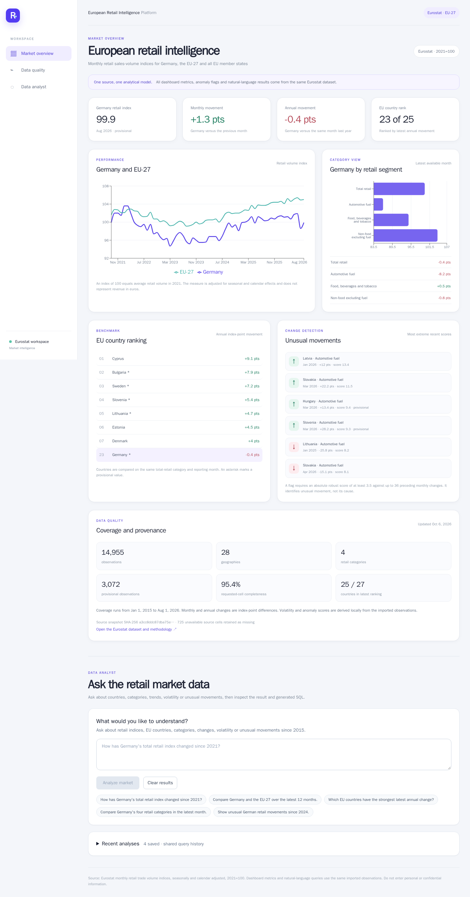

# European Retail Intelligence Platform

A governed analytics workspace for non-technical stakeholders to explore official European retail-market data. The dashboard and natural-language analyst use one imported dataset: Eurostat's monthly retail trade volume index (`sts_trtu_m`). A question is converted into a typed query plan and read-only PostgreSQL statement, validated before execution, and returned with the SQL and evidence visible to the user.



## What the platform answers

The curated dataset covers the EU-27 aggregate and all 27 member states from 2015 onward for four retail categories:

- total retail;
- food, beverages and tobacco;
- non-food excluding automotive fuel;
- automotive fuel.

All observations use Eurostat's seasonally and calendar-adjusted volume index with 2021=100. Values measure sales volume, not money. A level of 105 means the estimated retail volume is 5% above the average level in 2021. Moving from 103.9 to 105.0 is an increase of 1.1 index points and approximately 1.1% relative to the starting level (`1.1 / 103.9`).

The dashboard provides Germany and EU-27 history, Germany's category mix, a same-period country ranking, requested-cell completeness, latest-period country coverage and provisional-value counts. It also flags unusual monthly movements with a robust score calculated against up to 36 preceding monthly changes. A flag means a movement is statistically unusual in that series; it does not identify a cause.

The natural-language analyst supports the same countries, categories, periods, index values, monthly and annual changes, rolling volatility and anomaly fields shown on the dashboard. It cannot answer questions about revenue, customers, products, profit, prices or individual companies because those fields do not exist in this dataset.

## Why there is no forecast

The earlier forecasting view was removed. Its model did not consistently improve on transparent baselines, and a national retail index is not a credible company-demand forecast. The current project is stronger as an auditable analytics product: one current source, repeatable ingestion, deterministic derived metrics, data-quality evidence, anomaly detection and governed natural-language SQL. A forecast should be added only when a specific decision, target, evaluation window and baseline can be defended.

## Stack

| Area | Technology |
| --- | --- |
| Frontend | React 19, TypeScript, Vite, Tailwind CSS, Recharts |
| API | FastAPI, Pydantic, SQLAlchemy |
| Data | PostgreSQL 16, Alembic, Eurostat JSON-stat API |
| AI providers | Groq or Microsoft Foundry Local through OpenAI-compatible chat completions |
| Query controls | SQLGlot, allowlisted schema, read-only database role, statement timeout, row and byte limits |
| Tests | Pytest, Vitest, Testing Library, Playwright, Ruff, ESLint |
| Runtime | Docker Compose, Nginx |

## Start the application

Copy the environment template and provide three distinct database passwords:

```bash
cp .env.example .env
openssl rand -hex 24
```

Place each generated password in `POSTGRES_PASSWORD`, `APP_DB_PASSWORD` and `ANALYTICS_DB_PASSWORD`. Do not commit `.env`.

Start the services and import the current Eurostat snapshot:

```bash
docker compose up --build -d
docker compose --profile eurostat-data run --build --rm eurostat-data
```

Open <http://localhost:5173>. API documentation is available at <http://localhost:5173/api/docs>. Re-run the `eurostat-data` command when you want a fresh Eurostat snapshot. The importer validates dimensions, geographies, categories, values and response size before replacing the previous observations in one transaction. You can pin a downloaded response with `--payload` and `--expected-sha256` for a reproducible import.

## Configure an AI provider

The dashboard works without an AI provider. Natural-language questions require one of the following configurations.

### Groq

```dotenv
AI_PROVIDER=groq
AI_MODEL=openai/gpt-oss-20b
AI_API_URL=https://api.groq.com/openai/v1/chat/completions
AI_API_KEY=your_groq_key
AI_REQUEST_TIMEOUT_SECONDS=120
```

Groq's free tier is subject to account-specific rate and usage limits, and availability can change. Check the Groq console for current limits. A key remains sensitive even in a local `.env`; rotate any key that has been pasted into chat, logs or source control.

### Microsoft Foundry Local

Install and start Foundry Local in WSL or on the Windows host, then load Phi-4 Mini:

```bash
foundry --version
foundry server start --idle-timeout 0
foundry model load phi-4-mini
foundry server status
```

Use the URL printed by `foundry server status`; the port is dynamic. For a backend running directly in the same environment, use the printed loopback URL plus `/v1/chat/completions`. For Docker Desktop, replace `127.0.0.1` with `host.docker.internal`:

```dotenv
AI_PROVIDER=foundry_local
AI_MODEL=phi-4-mini
AI_API_URL=http://host.docker.internal:PORT/v1/chat/completions
AI_API_KEY=
AI_REQUEST_TIMEOUT_SECONDS=120
```

Phi-4 Mini runs locally without per-request API charges, but CPU inference can be slow and memory intensive. Groq is usually faster and lighter on the laptop.

After changing provider settings, recreate the backend:

```bash
docker compose up --build -d backend frontend
docker compose logs -f backend
```

## Query contract and security

`POST /query` accepts a question and up to three clarification turns. The provider must return a typed Pydantic plan. Executable plans require a catalogued metric, declared source table and one SQL statement. Clarification and blocked plans cannot contain SQL.

Only `retail_observations` is queryable. SQLGlot rejects writes, multiple statements, unknown tables and unsafe constructs, then applies the configured outer row limit. The query runs through a separate PostgreSQL reader role in a read-only transaction with a statement timeout and response-size cap. Saved history contains the bounded result snapshot so reopening an analysis does not call the provider again.

These controls reduce technical risk; they do not prove that every model-generated grouping or interpretation is analytically correct. The interface therefore displays the SQL, selected metric, filters, period and source table.

## Development and tests

Backend:

```bash
cd backend
python -m venv .venv
source .venv/bin/activate
pip install -r requirements-dev.txt
ruff check .
pytest -q -m "not integration"
```

Frontend:

```bash
cd frontend
npm ci
npm test -- --run
npm run lint
npm run build
npx playwright test
```

Tests cover provider contracts, malformed JSON, prompt boundaries, metric-policy mismatches, SQL injection and unsafe statements, statement/result limits, import schema drift, missing periods, anomaly calculations, database roles, API behavior, clarification, history restoration, auto-scroll, charts, CSV safety and mobile layout.

## Limits

This is a portfolio analytics application, not a production multi-tenant BI service. It has shared query history and no authentication, scheduler, alert delivery or monitoring stack. Eurostat observations may be missing, provisional or revised. The index measures relative retail volume and cannot establish business causes, calculate monetary sales or predict a company's demand. The current geography is the EU rather than a global market.

Source: [Eurostat monthly retail trade volume index (`sts_trtu_m`)](https://ec.europa.eu/eurostat/databrowser/view/sts_trtu_m/default/table).
